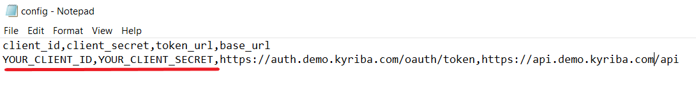

# basic-App-Export-with-Tasks-API-sample


## Requirements

Opening .ipynb files requires:
1. Google account
2. [Google Colaboratory][1]

[1]: https://workspace.google.com/marketplace/app/colaboratory/1014160490159?pann=ogb


## Installation

1.  Copy the repository link, open Command Prompt, go to the location where file will be copied and execute git clone command:

```shell
git clone https://github.com/Hercain/basic-App-Export-with-Tasks-API-sample.git
```

2. Import Basic_App_Export_with_Tasks_API.ipynb file into your Google Drive.

3. Open config.csv file and input your client credentials by replacing the highlighted items with your client_id and client_secret, separated by the coma. Config file should look like this:



4. Open the jupyter notebook with Google Collab.

5. In the Table of Content on the left, click on the folder logo  which opens Files section, find 'content' folder and upload config.csv file into this folder.

6. Run application. You can run the whole application: Runtime -> Run all, or execute separated cells.

> ⚠️  _Please notice that Python is script language and code will be executed row by row or in the order you will run the cells._

7. Find the generated token under "Connect" cell and the sample result in the next one. The "Launch Process Template report and show retrieved results" cell visualizes the launched report, based on the chosen Process Template, with customizable amount of rows displayed in CSV table.

