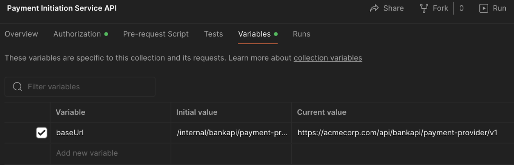

# Payment Service Provider Integration


## Requirements

Opening Postman collections requires [Postman][1]

[1]: https://www.postman.com/


## Local Installation

1.  Copy the repository link, open Command Prompt, go to the location where file will be copied and execute git clone command:

```shell
git clone https://github.com/kyriba/Use_Cases_samples.git
```

2. Proceed to the "Use_Cases_Colab" folder.

3. Choose the folder with the "Payment_Service_Provider_Integration" name.

4. Find "kyriba-spi.cer.zip" and decompress it. The certificate will be used to sign the payload with the SHA256 algorithm.

5. Find the "payment-spi-validation_postman-collection.json" sample file.

6. Open your Postman and import the file.

7. Set your Base URL to the baseUrl collection variable.



8. Execute the requests in the collection.
